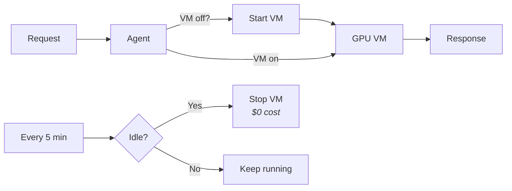
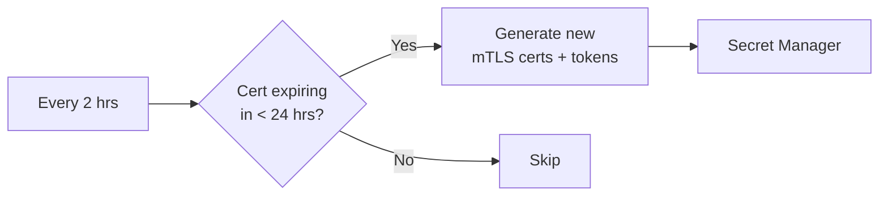

<p align="center">
  
</p>

<h1 align="center">Private LLM</h1>

<p align="center">
  <strong>Enterprise-grade privacy. No hardware to buy. No lab to maintain.</strong><br>
  Deploy in minutes. No one else sees your data.
</p>

---

## Why Private LLM?

**You want privacy**, but your options are painful:

| | Buy a Mac Mini? | Build a home lab? | Use public APIs? | **Private LLM** |
|---|---|---|---|---|
| **Cost** | $1,000+ upfront | $3,000+ for GPU server | Pay per token | **~$18/mo + usage** |
| **Maintenance** | You fix it when it breaks | Electricity, cooling, network, updates | None | **None** |
| **Privacy** | Local | Local | Third party sees everything | **You own it all** |
| **Future-proof** | Today's Mac can't run tomorrow's models | Hardware depreciates | Always latest | **Always latest** |
| **Your time** | Hours of setup | Weeks of tinkering | Minutes | **Minutes** |

**Private LLM gives you everything:**
- **100% privacy** -- Your infrastructure, your control, no third party in the data path
- **Zero maintenance** -- No hardware to buy, fix, or upgrade
- **Future-proof** -- Cloud GPUs scale with next-gen models; your Mac Mini doesn't
- **Deploy in minutes** -- Not weeks of home lab tinkering
- **Pay only when you use it** -- No idle hardware burning electricity
- **Works with every Ollama tool** -- The agent speaks the Ollama API on localhost; your tools don't know the difference

---

## Bring AI to Your Most Sensitive Data

With Private LLM, you can safely process:

- **Financial data** -- Bank statements, tax returns, investment portfolios
- **Credentials** -- API keys, passwords, access tokens
- **Personal documents** -- Journals, medical records, legal documents
- **Business secrets** -- Trade secrets, contracts, strategy documents
- **Source code** -- Proprietary algorithms, security-sensitive code

No more sanitizing prompts. No more trusting third parties. **Your infrastructure. Your control. No one else sees a thing.**

## Enterprise Security Controls

**The same FIPS-validated, NIST-compliant security primitives trusted by banks, healthcare, and federal agencies -- deployed in infrastructure you own.**

| Security Control | Implementation | What It Gives You |
|-----------------|-----------------|-------------------|
| **End-to-end encryption** | mTLS (Mutual TLS 1.3) | Every request encrypted with 4096-bit RSA; both client and server authenticated |
| **No middlemen in data path** | Direct mTLS (localhost to VM) | No cloud load balancers, proxies, or functions see your plaintext |
| **Hardware-protected secrets** | HSM + KMS | Encryption keys managed by dedicated hardware; even cloud admins can't access |
| **Verified boot chain** | Shielded VM (Secure Boot + TPM) | VM integrity verified at every boot; tampering detected immediately |
| **Dynamic firewall** | Ephemeral IP-locked rules | Only your current IP can reach the VM; rule deleted on agent shutdown |
| **Assume breach posture** | Zero Trust Architecture | No implicit trust; every request validated with mTLS + internal token |
| **Data stays yours** | Your Cloud Account | Prompts and responses never leave your infrastructure |
| **Nothing recorded** | Zero Data Logging | No prompts, responses, or telemetry stored anywhere |
| **Tamper-proof deployments** | Immutable Infrastructure | No configuration drift; every deploy is identical |
| **Binary tampering detection** | File Integrity Monitoring (FIM) | Critical binaries checksummed every 5 minutes; tampering triggers alerts |
| **Aggressive secret rotation** | Automated Key Rotation | mTLS certificates and internal tokens have 7-day lifespans with 2-hour rotation checks |

**Built on validated standards:**
- HSM key protection: [FIPS 140-2 Level 3](https://cloud.google.com/security/compliance/fips-140-2-validated)
- Zero Trust design: [NIST SP 800-207](https://csrc.nist.gov/pubs/sp/800/207/final)
- Hardware root of trust: [TPM 2.0 specification](https://cloud.google.com/compute/shielded-vm/docs/shielded-vm)

## Quick Start

```bash
# Deploy infrastructure (requires GCS bucket for Terraform state)
TFSTATE_BUCKET=your-bucket-name make deploy

# Build agent and generate config
make install

# Start the agent (acts as Ollama on localhost:11434)
private-llm-agent
```

Now use any Ollama-compatible tool -- no API keys, no config changes:

```bash
ollama list                  # List models (starts VM automatically)
ollama pull llama3.2:1b      # Pull a model
ollama run llama3.2:1b       # Chat

# Or use curl directly
curl http://localhost:11434/api/tags
```

Ctrl+C the agent to clean up the firewall rule. The VM auto-stops after idle timeout.

## Use with Coding Agents

The agent speaks the Ollama API on localhost, so any coding agent that supports Ollama works out of the box:

```bash
ollama launch claude       # Claude Code
ollama launch codex        # OpenAI Codex
ollama launch openclaw     # OpenClaw
```

All traffic stays on your infrastructure -- same mTLS encryption, same zero-logging guarantees, even when an agent is reading your entire codebase.

See the [full list of Ollama integrations](https://docs.ollama.com/integrations) for more tools you can use.

## Architecture

### How It Works

```
Tool (Ollama CLI, etc.)
  |
  | HTTP (localhost only)
  v
Local Agent (:11434)
  |  - Starts VM if stopped
  |  - Opens firewall for your IP
  |  - Loads mTLS certs from Secret Manager
  |  - Updates Firestore heartbeat
  |
  | mTLS (TLS 1.3, 4096-bit RSA)
  v
Shielded GPU VM (:8080)
  |  - Caddy validates mTLS + internal token
  v
Ollama
```

No cloud proxy, no load balancer, no function in the data path. The mTLS tunnel goes directly from your machine to the VM.

### Scale to Zero



### Secret Rotation



## Cost

**Fixed costs** (always paid):
- Storage (128GB Hyperdisk Balanced): ~$18/month

**Variable costs** (only when running):
- Spot VM with GPU: ~$0.25/hour (L4) or $1.80/hour (RTX 6000 Blackwell 96GB)

| Monthly usage | L4 (24GB VRAM) | RTX 6000 Blackwell (96GB VRAM) |
|---------------|----------------|------------------|
| **0 hours** (idle) | $18 | $18 |
| **40 hours** (~10 hrs/week) | $28 | $90 |
| **160 hours** (~40 hrs/week) | $58 | $306 |
| **300 hours** (heavy use) | $92 | $557 |
| **730 hours** (24/7) | $200 | $1331 |

*Spot pricing varies by region. Estimates based on us-central1.*

## Cloud Support

- Google Cloud Platform
- AWS (coming soon)
- Azure (coming soon)

## License

[PolyForm Noncommercial 1.0.0](LICENSE) -- free for personal and internal use, not for commercial resale or hosted services.

---

<p align="center"><strong>Your infrastructure. Your control. No middlemen. Ever.</strong></p>
