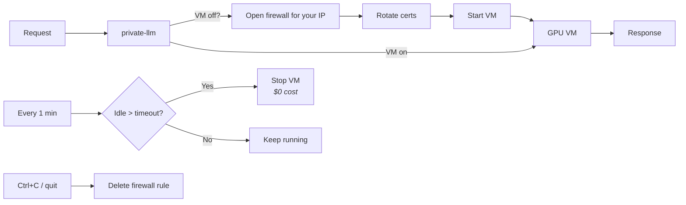

<p align="center">
  
</p>

<h1 align="center">Private LLM</h1>

<p align="center">
  <strong>Enterprise-grade security. Zero-trust architecture. No hardware to buy.</strong><br>
  A single binary with mTLS, private CA, cert pinning, per-session secret rotation, IP-locked firewalls, and HSM-backed encryption — all provisioned automatically.<br>
  Your data never touches a third party. Deploy in minutes.
</p>

---

## Why Private LLM?

**You want privacy**, but your options are painful:

| | Buy a Mac Mini? | Build a home lab? | Use public APIs? | **Private LLM** |
|---|---|---|---|---|
| **Cost** | $1,000+ upfront | $3,000+ for GPU server | Pay per token | **~$18/mo + usage** |
| **Maintenance** | You fix it when it breaks | Electricity, cooling, network, updates | None | **None** |
| **Privacy** | Local | Local | Third party sees everything | **You own it all** |
| **Future-proof** | Today's Mac can't run tomorrow's models | Hardware depreciates | Always latest | **Always latest** |
| **Your time** | Hours of setup | Weeks of tinkering | Minutes | **Minutes** |

**Private LLM gives you everything:**
- **100% privacy** -- Your infrastructure, your control, no third party in the data path
- **Zero maintenance** -- No hardware to buy, fix, or upgrade
- **Future-proof** -- Cloud GPUs scale with next-gen models; your Mac Mini doesn't
- **Deploy in minutes** -- Not weeks of home lab tinkering
- **Pay only when you use it** -- No idle hardware burning electricity
- **Works with every Ollama tool** -- Speaks the Ollama API on localhost; your tools don't know the difference

---

## Bring AI to Your Most Sensitive Data

With Private LLM, you can safely process:

- **Financial data** -- Bank statements, tax returns, investment portfolios
- **Credentials** -- API keys, passwords, access tokens
- **Personal documents** -- Journals, medical records, legal documents
- **Business secrets** -- Trade secrets, contracts, strategy documents
- **Source code** -- Proprietary algorithms, security-sensitive code

No more sanitizing prompts. No more trusting third parties. **Your infrastructure. Your control. No one else sees a thing.**

## Enterprise Security Controls

**The same FIPS-validated, NIST-compliant security primitives trusted by banks, healthcare, and federal agencies -- deployed in infrastructure you own.**

| Security Control | Implementation | What It Gives You |
|-----------------|-----------------|-------------------|
| **End-to-end encryption** | mTLS (Mutual TLS 1.3) | Every request encrypted with 4096-bit RSA; both client and server authenticated |
| **No middlemen in data path** | Direct mTLS (localhost to VM) | No cloud load balancers, proxies, or functions see your plaintext |
| **Split-trust CA** | CA key local-only | CA private key never leaves your machine; cloud compromise cannot forge certificates |
| **Hardware-protected secrets** | HSM + KMS | Encryption keys managed by dedicated hardware; even cloud admins can't access |
| **Verified boot chain** | Shielded VM (Secure Boot + TPM) | VM integrity verified at every boot; tampering detected immediately |
| **Dynamic firewall** | Ephemeral IP-locked rules | Only your current IP can reach the VM; rule deleted on shutdown |
| **Cert fingerprint pinning** | SHA-256 pin in memory | Server cert fingerprint verified on every connection; MITM detected even if CA is compromised |
| **Assume breach posture** | Zero Trust Architecture | No implicit trust; every request validated with mTLS + bearer token |
| **Data stays yours** | Your Cloud Account | Prompts and responses never leave your infrastructure |
| **Nothing recorded** | Zero Data Logging | No prompts, responses, or telemetry stored anywhere |
| **Tamper-proof deployments** | Immutable Infrastructure | No configuration drift; every deploy is identical |
| **Binary tampering detection** | File Integrity Monitoring (FIM) | Critical binaries checksummed every 5 minutes; tampering triggers alerts |
| **Automatic cert rotation** | Rotated on every cold start | Fresh mTLS certs (7-day lifespan) and bearer token generated before each VM boot |

**Built on validated standards:**
- HSM key protection: [FIPS 140-2 Level 3](https://cloud.google.com/security/compliance/fips-140-2-validated)
- Zero Trust design: [NIST SP 800-207](https://csrc.nist.gov/pubs/sp/800/207/final)
- Hardware root of trust: [TPM 2.0 specification](https://cloud.google.com/compute/shielded-vm/docs/shielded-vm)

## Quick Start

### Prerequisites

- A GCP project with billing enabled
- Application Default Credentials (`gcloud auth application-default login`)

### Install and deploy

```bash
curl -fsSL https://raw.githubusercontent.com/stewartpark/private-llm/main/misc/install.sh | sh
private-llm up  # Prompts for project, provisions infrastructure, generates mTLS certs
```

On first run with no config file, `up` infers your GCP project from Application Default Credentials, prompts to confirm, and saves `~/.config/private-llm/agent.json`. Everything else has sensible defaults. You can also pass flags directly:

```bash
private-llm up --project-id=my-project --zone=us-central1-a --machine-type=g2-standard-8
```

### Start the proxy

```bash
private-llm   # Listens on localhost:11434 (Ollama-compatible)
```

Now use any Ollama-compatible tool -- no API keys, no config changes:

```bash
ollama list                  # List models (starts VM automatically)
ollama pull llama3.2:1b      # Pull a model
ollama run llama3.2:1b       # Chat
```

Ctrl+C to shut down. The firewall rule is deleted automatically. The VM auto-stops after the idle timeout.

## Use with Coding Agents

Private LLM speaks the Ollama API on localhost, so any tool that supports Ollama works out of the box -- coding agents, chat UIs, IDE extensions. Same enterprise-grade privacy, even when an agent is reading your entire codebase.

```bash
ollama launch claude       # Claude Code
ollama launch codex        # OpenAI Codex
ollama launch opencode      # OpenCode
```

See [`ollama launch`](https://github.com/ollama/ollama/blob/main/docs/launch.md) and the [full list of Ollama integrations](https://ollama.com/blog/tool-support) for more tools.

## CLI Reference

```
Usage: private-llm [flags]
       private-llm <command> [flags]

Flags:
  -help            Display this message
  -config string   Path to agent.json (default ~/.config/private-llm/agent.json)
  -port int        Listen port (default 11434)
  -allow-all       Allow all IPs in firewall instead of just yours

Commands:
  up               Provision or reconcile infrastructure + generate certs
  down             Destroy all infrastructure
  rotate-mtls-ca   Force-rotate the CA and all certificates (use if CA is compromised)
```

### Dashboard Shortcuts

`private-llm` launches a fullscreen terminal dashboard with live status, token throughput, and a request log. Keyboard shortcuts:

| Key | Action |
|-----|--------|
| `q` / `Esc` / `Ctrl+C` | Quit (deletes firewall rule, VM auto-stops on idle) |
| `r` | Restart VM (stop, rotate certs, start) |
| `R` | Reset VM (delete and recreate from scratch) |
| `S` | Stop or start VM (toggles based on current state) |

### `private-llm up`

Provisions infrastructure with a preview-confirm-apply flow. Shows a diff of what will change, asks for confirmation, then applies. Certificates are only generated on first run; subsequent runs skip cert generation if secrets already exist.

All config values can be passed as flags to `up`. They override the config file and are saved for future commands.

| Flag | Default | Description |
|------|---------|-------------|
| `--project-id` | From Application Default Credentials | GCP project ID |
| `--zone` | `us-central1-a` | GCP zone (determines GPU availability) |
| `--vm-name` | `private-llm-vm` | VM instance name |
| `--network` | `private-llm` | VPC network name |
| `--region` | Derived from zone | GCP region |
| `--machine-type` | `g4-standard-48` | VM machine type (determines GPU) |
| `--default-model` | `qwen3-coder-next:q8_0` | Model to pull and warm on boot |
| `--context-length` | `262144` | Ollama context window size |
| `--idle-timeout` | `300` | Seconds of idle before VM auto-stops |
| `--subnet-cidr` | `10.10.0.0/24` | VPC subnet CIDR |
| `--subnet` | `private-llm-subnet` | Subnet name |
| `--disable-hsm` | `false` | Skip KMS/HSM key management |

## Architecture

### How It Works

```
Tool (Ollama CLI, coding agent, etc.)
  |
  | HTTP (localhost only)
  v
private-llm (:11434)               ← Fullscreen TUI dashboard
  |  - Opens firewall for your IP     - Live token counting (in/out/tok/s)
  |  - Rotates certs if VM is stopped - Request log with latency
  |  - Starts VM if needed            - VM/cert/firewall status
  |  - Loads mTLS certs from local disk
  |  - Verifies server cert fingerprint (pinned)
  |
  | mTLS (TLS 1.3, 4096-bit RSA)
  v
Shielded GPU VM (:8080)
  |  - Caddy validates mTLS + bearer token
  v
Ollama
```

No cloud proxy, no load balancer, no function in the data path. The mTLS tunnel goes directly from your machine to the VM.

The proxy counts tokens in real time across all supported API styles (Ollama, OpenAI Chat, Anthropic Messages, OpenAI Responses) and displays live throughput in the dashboard.

### Infrastructure (Pulumi)

All infrastructure is defined as Go code using the [Pulumi Automation API](https://www.pulumi.com/docs/using-pulumi/automation-api/) -- no Terraform, no Pulumi CLI, no external tools. Everything is embedded in the single `private-llm` binary.

`private-llm up` provisions:
- **VPC + Subnet** with Private Google Access
- **KMS KeyRing + CryptoKey** (HSM-backed, 90-day auto-rotation)
- **4 Secrets** in Secret Manager (CA cert, server cert, server key, bearer token) -- encrypted with KMS
- **Service Account** for the VM (minimal permissions: logging + monitoring)
- **Shielded GPU VM** (Spot instance, Secure Boot, vTPM, Hyperdisk Balanced)

State is stored locally at `~/.config/private-llm/state/`. No remote backend needed.

### Split-Trust Certificate Model

```
~/.config/private-llm/certs/ (local only)     Secret Manager (cloud)
├── ca.key    ← NEVER in cloud                ├── ca-cert (public only)
├── ca.crt                                     ├── server-cert
├── client.crt                                 ├── server-key
├── client.key                                 └── internal-token
└── token
```

The CA private key never leaves your machine. Even if GCP is fully compromised, an attacker cannot forge valid certificates. The CLI also pins the server certificate's SHA-256 fingerprint in memory, detecting impersonation even if the CA cert in Secret Manager is replaced.

### Scale to Zero



On the first request the CLI opens a dynamic firewall rule locked to your public IP, rotates all secrets (certs + token), then starts the VM. While running, the VM monitors its own Caddy access log — if no requests arrive within the idle timeout (default 5 minutes), it shuts itself down. On the next request, the CLI repeats the full cycle: firewall, rotate, start. When you quit the CLI (`Ctrl+C`, `q`, `Esc`), the firewall rule is deleted immediately. Only the first-ever boot gets a 30-minute grace period for package installation; subsequent boots check idle immediately.

### Secret Rotation

All secrets are rotated automatically on every cold start — every time the VM transitions from stopped to running:

1. CLI opens (or updates) a dynamic firewall rule locked to your current public IP
2. CLI generates new server cert + key (7-day validity), client cert + key, and bearer token
3. Server artifacts are written to Secret Manager; client artifacts are written to local disk
4. CLI pins the new server cert fingerprint in memory
5. VM boots and fetches fresh server certs + token from Secret Manager

The CA certificate (10-year validity) is reused across rotations and only regenerated if nearing expiry. The firewall rule is deleted when the CLI exits.

**Emergency CA rotation:** If you suspect your CA private key has been compromised, force-rotate the entire certificate chain:

```bash
private-llm rotate-mtls-ca   # Deletes CA, regenerates everything, pushes to Secret Manager
```

This generates a new CA, new server/client certs, and a new bearer token. Restart the VM afterward to pick up the new server certs.

## Cost

**Fixed costs** (always paid):
- Storage (128GB Hyperdisk Balanced): ~$18/month

**Variable costs** (only when running):
- Spot VM with GPU: ~$0.25/hour (L4) or ~$1.80/hour (RTX 6000 Blackwell 96GB)

| Monthly usage | L4 (24GB VRAM) | RTX 6000 Blackwell (96GB VRAM) |
|---------------|----------------|------------------|
| **0 hours** (idle) | $18 | $18 |
| **40 hours** (~10 hrs/week) | $28 | $90 |
| **160 hours** (~40 hrs/week) | $58 | $306 |
| **300 hours** (heavy use) | $92 | $557 |
| **730 hours** (24/7) | $200 | $1,331 |

*Spot pricing varies by region. Estimates based on us-central1.*

## Cloud Support

- Google Cloud Platform
- AWS (coming soon)
- Azure (coming soon)

## License

[PolyForm Noncommercial 1.0.0](LICENSE) -- free for personal and internal use, not for commercial resale or hosted services.

---

<p align="center"><strong>Your infrastructure. Your control. No middlemen. Ever.</strong></p>
