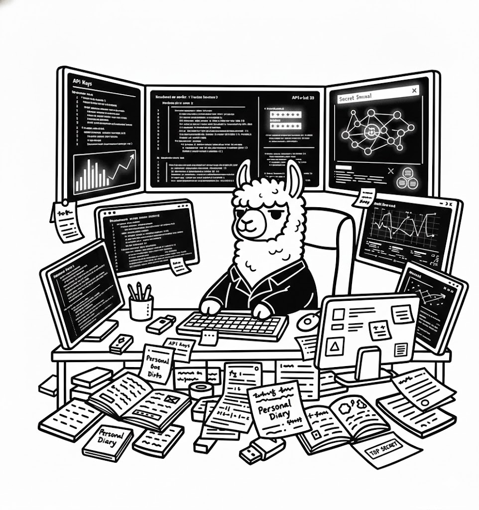
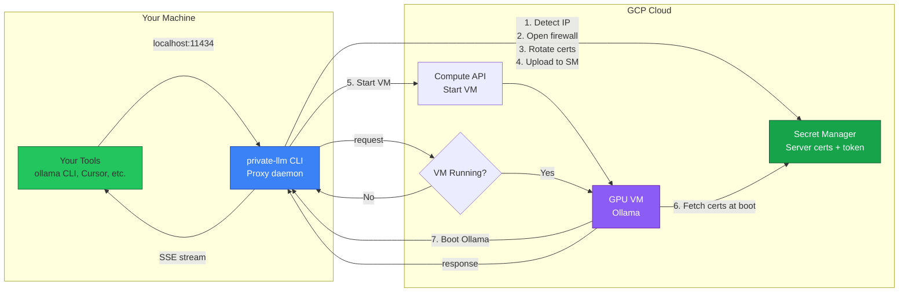
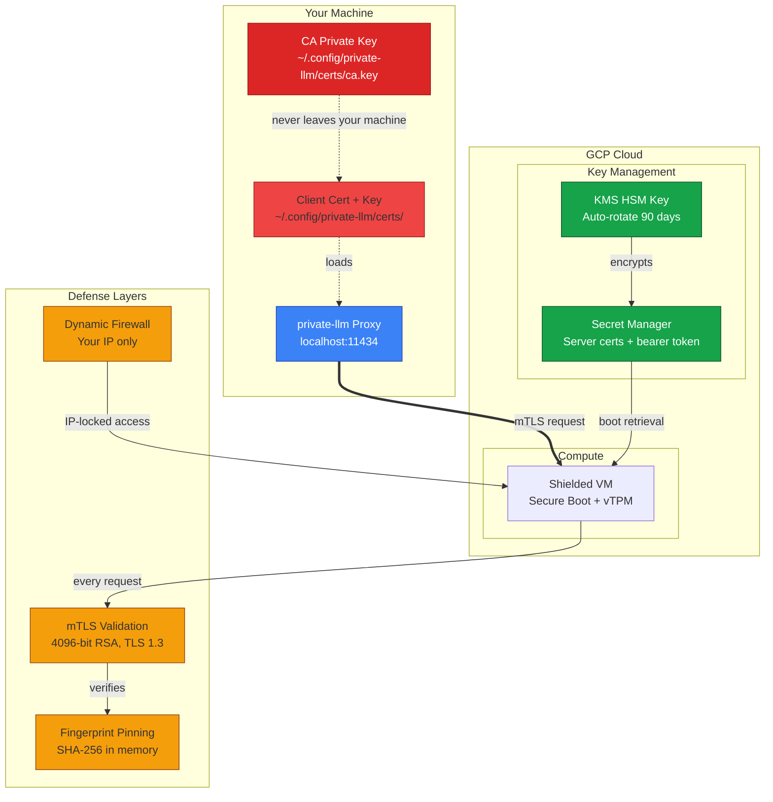
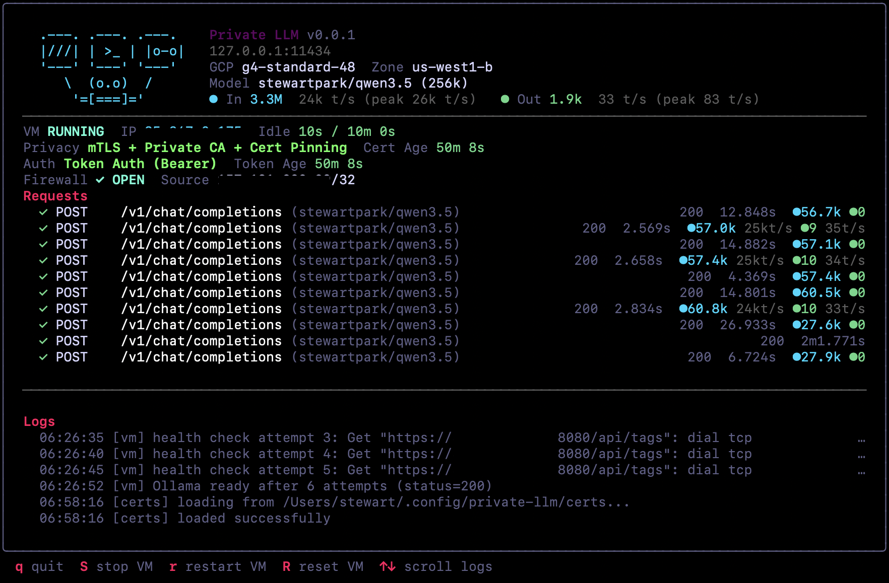

<div align="center">

<picture>
<source media="(prefers-color-scheme: dark)" srcset="misc/logo.jpg">

</picture>

# Private LLM

**Your AI. Your infrastructure. Zero middlemen. Security built for zero trust.**

<a href="#install">
  
</a>

<span style="font-size: 14px; color: #666;">macOS App (signed) • CLI • Linux systemd</span>

<br>


</div>

---

## Stop trusting third parties with your data

Every prompt you send to cloud AI providers is logged. Stored. Possibly used to train their models.

**Private LLM changes the game:**

- 🔒 **4096-bit RSA, TLS 1.3** — Exceeds typical enterprise standards
- 🏛️ **HSM-backed key management** — Hardware security module, 90-day auto-rotation
- 🔄 **Aggressive key rotation** — Fresh certs every VM boot
- 🛡️ **Zero-trust architecture** — CA key never leaves your machine

```bash
# macOS: Download, sign GCP once, run `private-llm up`
# CLI: one-liner install, interactive setup, done

# Your tools think it's local Ollama
$ ollama run stewartpark/qwen3.5
```

---

## Private LLM vs. the Cloud

| | Cloud AI Providers | Private LLM |
|---|---|---|
| **Your prompts** | Logged, stored, possibly trained on | Never leave your infrastructure, certs auto-rotate |
| **Cost** | Per token, opaque pricing | GPU hourly, scales to zero |
| **Control** | Their rates, their uptime, their rules | You own the VM, you set idle timeout |
| **Compliance** | Their SOC 2, their BAA | Your GCP project, your KMS keys |

---

## Install

### macOS App (Recommended)

1. **Download** [latest release](https://github.com/stewartpark/private-llm/releases/latest)
2. **Sign into GCP** (one-time):
   ```bash
   gcloud auth application-default login
   ```
3. **Run `up`** from the menu bar → follow interactive prompts

**Done.** Menu bar icon shows status. No terminal needed.

### CLI (All Platforms)

```bash
curl -fsSSL https://raw.githubusercontent.com/stewartpark/private-llm/main/misc/install.sh | sh
```

Then:
```bash
$ gcloud auth application-default login  # one-time
$ private-llm up                         # interactive setup
$ private-llm                            # start dashboard
```

**Total time:** ~5 min (first boot: 30 min for package installs; subsequent: 3-5 min)

---

## How It Works


```mermaid
flowchart LR
    subgraph "Your Machine"
        A[Your Tools<br/>ollama CLI, Cursor, etc.]
        B[private-llm CLI<br/>Proxy daemon]
    end
    
    subgraph GCP[GCP Cloud]
        C{VM Running?}
        D[Compute API<br/>Start VM]
        E[Secret Manager<br/>Server certs + token]
        F[GPU VM<br/>Ollama]
    end
    
    A -->|localhost:11434| B
    B -->|request| C
    C -->|No| B
    B -->|1. Detect IP<br/>2. Open firewall<br/>3. Rotate certs<br/>4. Upload to SM| E
    B -->|5. Start VM| D
    D --> F
    F -->|6. Fetch certs at boot| E
    F -->|7. Boot Ollama| B
    C -->|Yes| F
    F -->|response| B
    B -->|SSE stream| A
    
    style A fill:#22c55e,stroke:#166534
    style B fill:#3b82f6,stroke:#1e40af,color:white
    style F fill:#8b5cf6,stroke:#6b21a8,color:white
    style E fill:#16a34a,stroke:#14532d,color:white
```

1. **Install** (app or CLI) — CA private key stays on your machine
2. **Provision** — `private-llm up` creates VPC, KMS HSM key, shielded VM
3. **Run** — `private-llm` starts proxy with live TUI dashboard
4. **Use** — Any Ollama tool works (localhost:11434)
5. **Scale to zero** — VM auto-stops after 5 min idle ($0 when not in use)

---

## Security Architecture


```mermaid
graph TB
    subgraph "Your Machine"
        A[CA Private Key<br/>~/.config/private-llm/certs/ca.key]
        B[Client Cert + Key<br/>~/.config/private-llm/certs/]
        P[private-llm Proxy<br/>localhost:11434]
    end
    
    subgraph GCP[GCP Cloud]
        subgraph "Key Management"
            C[KMS HSM Key<br/>Auto-rotate 90 days]
            D[Secret Manager<br/>Server certs + bearer token]
        end
        
        subgraph "Compute"
            E[Shielded VM<br/>Secure Boot + vTPM]
        end
    end
    
    subgraph "Defense Layers"
        F[mTLS Validation<br/>4096-bit RSA, TLS 1.3]
        G[Fingerprint Pinning<br/>SHA-256 in memory]
        H[Dynamic Firewall<br/>Your IP only]
    end
    
    A -.->|never leaves your machine| B
    B -.->|loads | P
    P ==>|mTLS request | E
    C -->|encrypts| D
    D -->|boot retrieval| E
    E -->|every request| F
    F -->|verifies| G
    H -->|IP-locked access| E
    
    style A fill:#dc2626,stroke:#991b1b,color:white
    style B fill:#ef4444,stroke:#991b1b
    style P fill:#3b82f6,stroke:#1e40af,color:white
    style C fill:#16a34a,stroke:#14532d,color:white
    style D fill:#16a34a,stroke:#14532d,color:white
    style F fill:#f59e0b,stroke:#92400e
    style G fill:#f59e0b,stroke:#92400e
    style H fill:#f59e0b,stroke:#92400e
```

**Zero-trust model:** CA key isolation means GCP cannot forge certificates or intercept traffic (only your machine can sign certs). Fingerprint pinning detects MITM attacks. Firewall rule deleted when you quit.

---

## GPU Options

| Type | GPU | VRAM | Best For | ~$/hr |
|---|---|---|---|---|
| `g2-standard-4` | L4 | 24GB | 7B-13B models | 0.25 |
| `g4-standard-48` | RTX 6000 | 96GB | 70B+ models (default) | 1.80 |
| `a2-standard-12` | A100 | 40GB | Legacy | 0.50 |
| `a3-standard-8` | H100 | 80GB | Cutting-edge | 2.50 |

**Monthly cost (g2-standard-4):** $18 (always off) → $28 (40 hrs) → $58 (160 hrs) → $200 (24/7)

---

## Dashboard

Running `private-llm` opens a live TUI with real-time stats:

<div align="center">
  
</div>

---

## Works With

Any Ollama-compatible tool:

- **CLI:** `ollama run llama3.2`
- **Agents:** [opencode](https://opencode.ai), [Aider](https://aider.chat), [Codex CLI](https://github.com/openai/codex), [Claude Code](https://docs.anthropic.com/en/docs/agents-and-tools/claude-code/overview) (via `ollama launch`)
- **IDEs:** Cursor, VS Code + Ollama extensions
- **Custom:** OpenAI API compatible (just change `base_url` to `http://localhost:11434`)

---

## Quick Reference

```bash
private-llm up                    # Provision infrastructure
private-llm down                  # Destroy infrastructure
private-llm                       # Start dashboard (proxy runs here)
private-llm rotate-mtls-ca        # Emergency: rotate all certs
```

**TUI Controls:** `q` quit | `r` restart | `R` reset (recreate) | `S` toggle VM

**Config:** `~/.config/private-llm/agent.json` (auto-created, editable via `up`)

**Docs:** [`AGENTS.md`](AGENTS.md) — architecture & design | [`SECURITY.md`](SECURITY.md) — threat model & controls | Linux packaging

---

## License

**PolyForm Noncommercial 1.0.0** — Free for personal/internal use. Not for SaaS or resale.

---

<div align="center">

**Your infrastructure. Your control. No middlemen. Ever.**

[Releases](https://github.com/stewartpark/private-llm/releases) • [Docs](AGENTS.md) • [Issues](https://github.com/stewartpark/private-llm/issues)

</div>
