<div align="center">

<picture>
<source media="(prefers-color-scheme: dark)" srcset="misc/logo.jpg">

</picture>

# Private LLM

**Run powerful AI on your own infrastructure. Your data never leaves your control.**

<a href="https://github.com/stewartpark/private-llm/releases/latest">
  
</a>

*Enterprise security. Zero maintenance. Deploy in minutes.*

</div>

---

## 🌟 What Is Private LLM?

Imagine running **powerful AI models** without:
- ❌ Paying per token to OpenAI, Anthropic, etc.
- ❌ Your prompts being logged or stored
- ❌ Buying expensive GPU hardware
- ❌ Setting up complex infrastructure

**Private LLM does this for you.**

It spins up a secure GPU server in the cloud that:
1. Starts automatically when you need it
2. Shuts down when you don't (saves $$)
3. Uses military-grade encryption (mTLS)
4. Works with your existing AI tools (Ollama-compatible)

```bash
# That's it - one command
$ private-llm up

# Start chatting
$ ollama run qwen3.5
```

---

## 🚀 Quick Start

### Step 1: Install the CLI

```bash
curl -fsSSL https://raw.githubusercontent.com/stewartpark/private-llm/main/misc/install.sh | sh
```

### Step 2: Set up GCP credentials

```bash
# Log into Google Cloud
gcloud auth application-default login
```

### Step 3: Deploy!

```bash
# Follow the interactive prompts
$ private-llm up

# Start the AI proxy
$ private-llm
```

**Total time: 5-10 minutes** (first VM boot takes ~30 min due to package installs, subsequent boots: 3-5 min)

---

## 💡 Use It With Any AI Tool

Once `private-llm` is running, any Ollama-compatible tool works:

```bash
# List available models
ollama list

# Pull a new model
ollama pull llama3.2

# Start chatting
ollama run llama3.2

# Works with coding agents too
ollama run codex
ollama run claude
```

**No API keys. No config changes.** The proxy listens on `localhost:11434` — your tools think it's a local Ollama server.

---

## ✨ Why Developers Love It

| Feature | Why It Matters |
|---------|---------------|
| **🔐 Your data stays private** | Prompts never leave your infrastructure — no third parties |
| **💰 Pay only when using** | Server shuts down automatically when idle — ~$0.25-1.80/hour when running, ~$18/month fixed storage |
| **🎯 No hardware to buy** | Professional GPU (L4 or RTX 6000) in the cloud, not in your basement |
| **🔧 Zero maintenance** | No system admin needed — updates, security, monitoring all automatic |
| **🔄 Always up-to-date** | Cloud GPUs scale with new models — your Mac Mini becomes obsolete, this doesn't |
| **⚡ Works with everything** | Ollama API compatible — tools like Continue, Cursor, Aider, Claude Code work out of the box |

---

## 🛡️ Enterprise-Grade Security

This isn't just a VM — it's a **zero-trust, encrypted tunnel directly from your laptop to the GPU**.


**Security features you get:**

- 🔒 **mTLS encryption** — 4096-bit RSA, TLS 1.3 (harder to break than most banking systems)
- 🔑 **CA key stays on your machine** — Even if GCP is compromised, they can't forge certificates
- 🕵️ **Cert pinning** — Fingerprint verification detects MITM attacks
- 🌐 **Dynamic firewall** — Only your current IP can reach the VM; deleted on shutdown
- 🔄 **Auto-rotating secrets** — Fresh certificates every time the VM starts
- 🏗️ **Shielded VM** — Secure Boot + vTPM prevent tampering
- 📊 **No logging** — Nothing is stored anywhere. Prompts, responses, queries — gone after use.

---

## 💸 Cost Breakdown

**Fixed (always paid, even when idle):**
- Storage: ~$18/month (128GB disk)

**Variable (only when VM is running):**
- L4 GPU (24GB VRAM): ~$0.25/hour
- RTX 6000 Blackwell (96GB VRAM): ~$1.80/hour

**Monthly examples (L4 GPU):**

| Usage | Cost |
|-------|------|
| 0 hours (always off) | $18 |
| 40 hours (~10 hrs/week) | $28 |
| 160 hours (~40 hrs/week) | $58 |
| 730 hours (24/7) | $200 |

*Compared to buying a Mac Mini M2 (~$1,000) + electricity (~$30/month) + replacement in 3-4 years = ~$2,000+ in 3 years vs. ~$400-800 with Private LLM.*

---

## 📊 Dashboard & Monitoring

Running `private-llm` opens a beautiful terminal dashboard:

```
┌─────────────────────────────────────────────────────────┐
│  🖥️  Private LLM Dashboard                              │
├─────────────────────────────────────────────────────────┤
│  Status:       🟢 RUNNING                               │
│  Model:        qwen3.5:122b                             │
│  Context:      262k tokens                              │
│  Uptime:       1h 23m                                   │
│  Tokens/sec:   42.3 ⬆️                                  │
│  Total:        318,492 tokens                           │
├─────────────────────────────────────────────────────────┤
│  📋 Recent Requests                                     │
│  21:32:15  /v1/chat/completions  1.2s  1.5k tokens      │
│  21:31:42  /api/generate       4.8s  3.2k tokens        │
│  21:28:11  /api/tags           0.05s  0 tokens          │
└─────────────────────────────────────────────────────────┘
     [r] Restart    [R] Reset    [S] Start/Stop    [q] Quit
```

**Keyboard shortcuts:**

- `q` / `Esc` / `Ctrl+C` — Quit (VM auto-stops after 5 min)
- `r` — Restart VM (rotate certs + reboot)
- `R` — Reset VM (delete and recreate from scratch)
- `S` — Toggle VM on/off

---

## 🏗️ Architecture Deep Dive

### How the Auto-Start / Auto-Stop Works

```mermaid
flowchart TD
    A[User makes request] --> B{VM running?}
    B -->|No| C[Open firewall for your IP]
    C --> D[Generate new certs + token]
    D --> E[Start VM]
    E --> F[Wait for Ollama ready]
    F --> G[Proxy request]
    
    B -->|Yes| G
    
    H[Timer: check every 1 min] --> I{Idle > 5 min?}
    I -->|Yes| J[Stop VM → $0 cost]
    I -->|No| K[Keep running]
```



**Simple explanation:**

1. You make a request (e.g., `ollama run qwen3.5`)
2. If the VM is off, it auto-starts
3. The VM monitors activity — if nothing for 5 minutes, it shuts down
4. Next request = auto-start again
5. When you quit (`Ctrl+C`), the firewall rule is deleted immediately

**Why?** Cost optimization. $0 when idle, ready in ~30 seconds when you need it.

### Security Flow


---

## 📖 CLI Reference

### Basic Commands

```bash
# Provision or update infrastructure
$ private-llm up

# Stop VM (firewall deleted, storage kept)
$ private-llm down

# View live dashboard
$ private-llm

# Emergency: Rotate all certificates if compromised
$ private-llm rotate-mtls-ca
```

### Configuration Options

All of these can be set interactively during `up`, or passed as flags:

| Flag | Default | Description |
|------|---------|-------------|
| `--project-id` | (from `gcloud`) | GCP project ID |
| `--zone` | `us-central1-a` | GCP zone |
| `--machine-type` | `g4-standard-48` | GPU type (see [GPU options](#%EF%B8%8F-gpu-options)) |
| `--default-model` | `qwen3.5:122b` | Model to pre-warm on boot |
| `--context-length` | `262144` | Max context window |
| `--idle-timeout` | `300` | Seconds idle before auto-stop |
| `--disable-hsm` | `false` | Skip HSM encryption (not recommended) |

### Global Flags

```bash
-help            Show help message
-config string   Config file path (default ~/.config/private-llm/agent.json)
-port int        Listen port (default 11434, Ollama-compatible)
-allow-all       Allow any IP in firewall (default: your IP only)
```

---

## 💻 GPU Options

Choose a GPU based on model size and budget:

| Type | GPU | VRAM | Best For | Hourly Cost |
|------|-----|------|----------|-------------|
| `g2-standard-4` | L4 | 24GB | 7B-13B models | ~$0.25 |
| `g4-standard-48` | RTX 6000 | 96GB | 70B+ models | ~$1.80 |
| `a2-standard-12` | A100 | 40GB | Legacy support | ~$0.50 |
| `a3-standard-8` | H100 | 80GB | Cutting-edge | ~$2.50 |

**Recommendation:** Start with `g2-standard-4` for smaller models (fast, cheap). Upgrade if you need to run 70B+ models.

---

## 🐞 Troubleshooting

### VM won't start

```bash
# Check GCP auth
gcloud auth application-default login

# Check VM status
cat ~/.config/private-llm/status

# Reset everything and start fresh
private-llm down
rm -rf ~/.config/private-llm/{state,certs}
private-llm up
```

### Certificate errors

```bash
# Clear local certs
rm -rf ~/.config/private-llm/certs/*

# Restart
private-llm down && private-llm up
```

### Can't connect to proxy

```bash
# Check if listening
netstat -an | grep 11434

# Try the Ollama API
curl http://localhost:11434/api/tags
```

### Firewall issues

```bash
# Test IP detection
curl https://api.ipify.org

# Force allow all in firewall
private-llm -allow-all
```

---

## 🔧 For Advanced Users

### Where Config Lives

| Path | Purpose |
|------|---------|
| `~/.config/private-llm/agent.json` | Main config file |
| `~/.config/private-llm/certs/` | Local TLS certificates |
| `~/.config/private-llm/state/` | Pulumi state |
| `~/.config/private-llm/status` | Current VM status |

### Custom Config File

```bash
# Use a different config file
private-llm --config /path/to/custom.json

# Create config interactively
private-llm configure --config /path/to/custom.json
```

### View Logs

```bash
# Check dashboard logs (running)
# Press keys in dashboard to view recent requests

# Check Pulumi state
ls -la ~/.config/private-llm/state/
```

### Linux Support

```bash
# Run as a system-wide service
sudo dpkg -i private-llm_*.deb
sudo systemctl start private-llm

# View logs
journalctl -u private-llm -f
```

---

## 🤝 Contributing

1. Read [`AGENTS.md`](AGENTS.md) for architecture and design decisions
2. Test changes locally (you'll need a GCP project)
3. Open a PR with clear description

**Important:** This is a single-file architecture. All infrastructure is defined in Go using the Pulumi Automation API — no Terraform, no external CLI needed.

---

## 📄 License

**PolyForm Noncommercial 1.0.0**

Free for personal and internal use. Not for commercial resale or hosted services.

This ensures Private LLM remains free for everyone while preventing SaaS arbitrage.

---

## 🙏 Acknowledgments

Built with:
- [Pulumi](https://pulumi.com) (Infrastructure as Code)
- [Ollama](https://ollama.com) (LLM runtime)
- [Caddy](https://caddyserver.com) (Web server + mTLS)
- [bubbletea](https://github.com/charmbracelet/bubbletea) (Terminal UI)

---

<div align="center">

### Your infrastructure. Your control. No middlemen. Ever.

[Documentation](AGENTS.md) • [Releases](https://github.com/stewartpark/private-llm/releases) • [Issues](https://github.com/stewartpark/private-llm/issues)

</div>
