<p align="center">
  
</p>

<h1 align="center">Private LLM</h1>

<p align="center">
  <strong>Enterprise-grade privacy. No hardware to buy. No lab to maintain.</strong><br>
  Deploy in minutes. No one else sees your data.
</p>

---

## Why Private LLM?

**You want privacy**, but your options are painful:

| | Buy a Mac Mini? | Build a home lab? | Use public APIs? | **Private LLM** |
|---|---|---|---|---|
| **Cost** | $1,000+ upfront | $3,000+ for GPU server | Pay per token | **~$17/mo + usage** |
| **Maintenance** | You fix it when it breaks | Electricity, cooling, network, updates | None | **None** |
| **Privacy** | ✅ Local | ✅ Local | ❌ Third party sees everything | **✅ You own it all** |
| **Future-proof** | ❌ Today's Mac can't run tomorrow's models | ❌ Hardware depreciates | ✅ Always latest | **✅ Always latest** |
| **Your time** | Hours of setup | Weeks of tinkering | Minutes | **Minutes** |

**Private LLM gives you everything:**
- ✅ **100% privacy** — Your infrastructure, your control, no third party sees your plaintext
- ✅ **Zero maintenance** — No hardware to buy, fix, or upgrade
- ✅ **Future-proof** — Cloud GPUs scale with next-gen models; your Mac Mini doesn't
- ✅ **Deploy in minutes** — Not weeks of home lab tinkering
- ✅ **Pay only when you use it** — No idle hardware burning electricity

---

## Bring AI to Your Most Sensitive Data

With Private LLM, you can safely process:

- **Financial data** — Bank statements, tax returns, investment portfolios
- **Credentials** — API keys, passwords, access tokens
- **Personal documents** — Journals, medical records, legal documents
- **Business secrets** — Trade secrets, contracts, strategy documents
- **Source code** — Proprietary algorithms, security-sensitive code

No more sanitizing prompts. No more trusting third parties. **Your infrastructure. Your control. No one else sees a thing.**

## Enterprise Security Controls

**The same FIPS-validated, NIST-compliant security primitives trusted by banks, healthcare, and federal agencies — deployed in infrastructure you own.**

| Security Control | Implementation | What It Gives You |
|-----------------|-----------------|-------------------|
| **End-to-end encryption** | mTLS (Mutual TLS 1.3) | Every request encrypted with 4096-bit RSA; both client and server authenticated |
| **Hardware-protected secrets** | HSM + KMS | Encryption keys managed by dedicated hardware; even cloud admins can't access |
| **Verified boot chain** | Shielded VM (Secure Boot + TPM) | VM integrity verified at every boot; tampering detected immediately |
| **Multi-layer authentication** | Defense in Depth | External token → mTLS tunnel → internal token; three layers, one compromise isn't enough |
| **Assume breach posture** | Zero Trust Architecture | No implicit trust; every request validated regardless of origin |
| **Data stays yours** | Your Cloud Account | Prompts and responses never leave your infrastructure |
| **Nothing recorded** | Zero Data Logging | No prompts, responses, or telemetry stored anywhere |
| **Tamper-proof deployments** | Immutable Infrastructure | No configuration drift; every deploy is identical |
| **Binary tampering detection** | File Integrity Monitoring (FIM) | Critical binaries checksummed every 5 minutes; tampering triggers alerts |
| **Aggressive secret rotation** | Automated Key Rotation | mTLS certificates and internal tokens have 7-day lifespans with 2-hour rotation checks; credential leaks expire before attackers can use them |

**Built on validated standards:**
- HSM key protection: [FIPS 140-2 Level 3](https://cloud.google.com/security/compliance/fips-140-2-validated)
- Zero Trust design: [NIST SP 800-207](https://csrc.nist.gov/pubs/sp/800/207/final)
- Hardware root of trust: [TPM 2.0 specification](https://cloud.google.com/compute/shielded-vm/docs/shielded-vm)

## Quick Start

```bash
# Deploy (requires GCS bucket for Terraform state)
TFSTATE_BUCKET=your-bucket-name make deploy

# Get your credentials
export LLM_PROXY_URL=$(terraform output -raw function_url)
export LLM_API_TOKEN=$(gcloud secrets versions access latest --secret=private-llm-api-token)
```

The API is OpenAI-compatible — use any OpenAI client library with `$LLM_PROXY_URL/v1` as the base URL and `$LLM_API_TOKEN` as the bearer token.

## Architecture

```mermaid
flowchart TB
    App["📱 Your Application"]

    App -->|"① External API Token"| Proxy

    subgraph Proxy["☁️ Cloud Functions (Proxy)"]
        P1["Validates your token"]
        P2["Establishes mTLS tunnel"]
    end

    Proxy -->|"② mTLS (TLS 1.3, 4096-bit RSA)"| VM

    subgraph VM["🔒 Shielded VM (Spot GPU)"]
        V1["Validates mTLS cert"]
        V2["③ Internal token auth"]
        V3["HSM-encrypted secrets"]
    end

    VM --> Response["✅ Your Response<br/><i>never logged, never stored</i>"]
```



## Cost

**Fixed costs** (always paid):
- Storage (100GB SSD): ~$17/month

**Variable costs** (only when running):
- Spot VM with GPU: ~$0.25/hour (L4) or ~$1.10/hour (A100)

| Monthly usage | L4 (24GB VRAM) | A100 (40GB VRAM) |
|---------------|----------------|------------------|
| **0 hours** (idle) | $17 | $17 |
| **40 hours** (~10 hrs/week) | $27 | $61 |
| **160 hours** (~40 hrs/week) | $57 | $193 |
| **300 hours** (heavy use) | $92 | $347 |
| **730 hours** (24/7) | $200 | $820 |

*Spot pricing varies by region. Estimates based on us-central1.*

## Cloud Support

- ✅ Google Cloud Platform
- 🚧 AWS (coming soon)
- 🚧 Azure (coming soon)

## License

[PolyForm Noncommercial 1.0.0](LICENSE) — free for personal and internal use, not for commercial resale or hosted services.

---

<p align="center"><strong>Your infrastructure. Your control. No middlemen. Ever.</strong></p>
